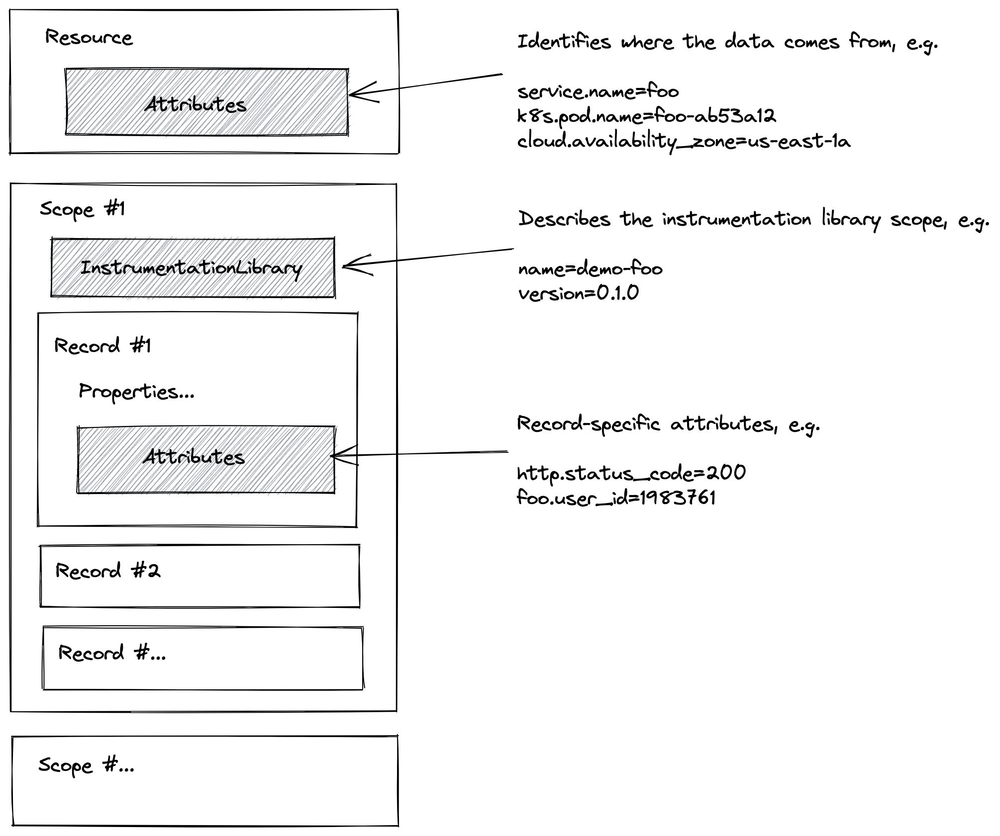

# OpenTelemetry Data Model 

* To start with, a lot of details are covered in [specification](https://github.com/open-telemetry/opentelemetry-specification) 
* OpenTelemetry is using a rich underlying data model 
* Protobuf definition in [opentelemetry-proto](https://github.com/open-telemetry/opentelemetry-proto)

# Concepts



# Resource

```protobuf
// Resource information.
message Resource {
  // Set of attributes that describe the resource.
  repeated opentelemetry.proto.common.v1.KeyValue attributes = 1;

  // dropped_attributes_count is the number of dropped attributes. If the value is 0, then
  // no attributes were dropped.
  uint32 dropped_attributes_count = 2;
}
```

```protobuf
message KeyValueList {
  // A collection of key/value pairs of key-value pairs. The list may be empty (may
  // contain 0 elements).
  // The keys MUST be unique (it is not allowed to have more than one
  // value with the same key).
  repeated KeyValue values = 1;
}
```

# Primitive Values

```protobuf
message KeyValue {
  string key = 1;
  AnyValue value = 2;
}
```

```protobuf
// AnyValue is used to represent any type of attribute value. AnyValue may contain a
// primitive value such as a string or integer or it may contain an arbitrary nested
// object containing arrays, key-value lists and primitives.
message AnyValue {
  // The value is one of the listed fields. It is valid for all values to be unspecified
  // in which case this AnyValue is considered to be "empty".
  oneof value {
    string string_value = 1;
    bool bool_value = 2;
    int64 int_value = 3;
    double double_value = 4;
    ArrayValue array_value = 5;
    KeyValueList kvlist_value = 6;
    bytes bytes_value = 7;
  }
}
```


# Instrumentation Scope

```protobuf
// InstrumentationScope is a message representing the instrumentation scope information
// such as the fully qualified name and version. 
message InstrumentationScope {
  // An empty instrumentation scope name means the name is unknown.
  string name = 1;
  string version = 2;
}
```

#

## Tracing

# Traces / ResourceSpans

```protobuf
// A collection of ScopeSpans from a Resource.
message ResourceSpans {
  // The resource for the spans in this message.
  // If this field is not set then no resource info is known.
  opentelemetry.proto.resource.v1.Resource resource = 1;

  // A list of ScopeSpans that originate from a resource.
  repeated ScopeSpans scope_spans = 2;

  // This schema_url applies to the data in the "resource" field. It does not apply
  // to the data in the "scope_spans" field which have their own schema_url field.
  string schema_url = 3;
}
```

# Traces / ScopeSpans

```protobuf
// A collection of Spans produced by an InstrumentationScope.
message ScopeSpans {
  // The instrumentation scope information for the spans in this message.
  // Semantically when InstrumentationScope isn't set, it is equivalent with
  // an empty instrumentation scope name (unknown).
  opentelemetry.proto.common.v1.InstrumentationScope scope = 1;

  // A list of Spans that originate from an instrumentation scope.
  repeated Span spans = 2;

  // This schema_url applies to all spans and span events in the "spans" field.
  string schema_url = 3;
}
```

# Traces / Span

```protobuf
message Span {
  bytes trace_id = 1;
  bytes span_id = 2;
  string trace_state = 3;
  bytes parent_span_id = 4;
  string name = 5;

  enum SpanKind {
    SPAN_KIND_UNSPECIFIED = 0;
    SPAN_KIND_INTERNAL = 1;

    ...
  }

  SpanKind kind = 6;
  fixed64 start_time_unix_nano = 7;
  fixed64 end_time_unix_nano = 8;
  repeated opentelemetry.proto.common.v1.KeyValue attributes = 9;
  uint32 dropped_attributes_count = 10;
  
  message Event {
    fixed64 time_unix_nano = 1;
    string name = 2;
    repeated opentelemetry.proto.common.v1.KeyValue attributes = 3;
    uint32 dropped_attributes_count = 4;
  }

  repeated Event events = 11;
  uint32 dropped_events_count = 12;

  ...
  
  Status status = 15;
}
```

# Note - a lot of detail in the original repository

```protobuf
  // A unique identifier for a trace. All spans from the same trace share
  // the same `trace_id`. The ID is a 16-byte array. An ID with all zeroes
  // is considered invalid.
  //
  // This field is semantically required. Receiver should generate new
  // random trace_id if empty or invalid trace_id was received.
  //
  // This field is required.
  bytes trace_id = 1;

  // A unique identifier for a span within a trace, assigned when the span
  // is created. The ID is an 8-byte array. An ID with all zeroes is considered
  // invalid.
  //
  // This field is semantically required. Receiver should generate new
  // random span_id if empty or invalid span_id was received.
  //
  // This field is required.
  bytes span_id = 2;

  // trace_state conveys information about request position in multiple distributed tracing graphs.
  // It is a trace_state in w3c-trace-context format: https://www.w3.org/TR/trace-context/#tracestate-header
  // See also https://github.com/w3c/distributed-tracing for more details about this field.
  string trace_state = 3;

  // The `span_id` of this span's parent span. If this is a root span, then this
  // field must be empty. The ID is an 8-byte array.
  bytes parent_span_id = 4;

  // A description of the span's operation.
  //
  // For example, the name can be a qualified method name or a file name
  // and a line number where the operation is called. A best practice is to use
  // the same display name at the same call point in an application.
  // This makes it easier to correlate spans in different traces.
  //
  // This field is semantically required to be set to non-empty string.
  // Empty value is equivalent to an unknown span name.
  //
  // This field is required.
  string name = 5;
```

#

## [Logs](https://github.com/open-telemetry/oteps/blob/main/text/logs/0097-log-data-model.md)

# Logs / ResourceLogs

```protobuf
// A collection of ScopeLogs from a Resource.
message ResourceLogs {
  // The resource for the logs in this message.
  // If this field is not set then resource info is unknown.
  opentelemetry.proto.resource.v1.Resource resource = 1;

  // A list of ScopeLogs that originate from a resource.
  repeated ScopeLogs scope_logs = 2;
```

# Logs / ScopeLogs


```protobuf
// A collection of Logs produced by a Scope.
message ScopeLogs {
  // The instrumentation scope information for the logs in this message.
  // Semantically when InstrumentationScope isn't set, it is equivalent with
  // an empty instrumentation scope name (unknown).
  opentelemetry.proto.common.v1.InstrumentationScope scope = 1;

  // A list of log records.
  repeated LogRecord log_records = 2;

  // This schema_url applies to all logs in the "logs" field.
  string schema_url = 3;
}
```

# Logs / LogRecords

```protobuf
message LogRecord {
  fixed64 time_unix_nano = 1;
  fixed64 observed_time_unix_nano = 11;
  SeverityNumber severity_number = 2;
  string severity_text = 3;

  // A value containing the body of the log record. Can be for example a human-readable
  // string message (including multi-line) describing the event in a free form or it can
  // be a structured data composed of arrays and maps of other values. [Optional].
  opentelemetry.proto.common.v1.AnyValue body = 5;
  uint32 dropped_attributes_count = 7;
  
  ...
}
```

#

## Metrics

# Metrics / ResourceMetrics

```protobuf
// A collection of ScopeMetrics from a Resource.
message ResourceMetrics {
  // The resource for the metrics in this message.
  // If this field is not set then no resource info is known.
  opentelemetry.proto.resource.v1.Resource resource = 1;

  // A list of metrics that originate from a resource.
  repeated ScopeMetrics scope_metrics = 2;
  
  // This schema_url applies to the data in the "resource" field. It does not apply
  // to the data in the "scope_metrics" field which have their own schema_url field.
  string schema_url = 3;
```

# Metrics / ScopeMetrics 

```protobuf
// A collection of Metrics produced by an Scope.
message ScopeMetrics {
  // The instrumentation scope information for the metrics in this message.
  // Semantically when InstrumentationScope isn't set, it is equivalent with
  // an empty instrumentation scope name (unknown).
  opentelemetry.proto.common.v1.InstrumentationScope scope = 1;

  // A list of metrics that originate from an instrumentation library.
  repeated Metric metrics = 2;

  // This schema_url applies to all metrics in the "metrics" field.
  string schema_url = 3;
}
```

# Metrics / Metric
```protobuf
message Metric {
  reserved 4, 6, 8;

  // name of the metric, including its DNS name prefix. It must be unique.
  string name = 1;

  // description of the metric, which can be used in documentation.
  string description = 2;

  // unit in which the metric value is reported. Follows the format
  // described by http://unitsofmeasure.org/ucum.html.
  string unit = 3;

  // Data determines the aggregation type (if any) of the metric, what is the
  // reported value type for the data points, as well as the relatationship to
  // the time interval over which they are reported.
  oneof data {
    Gauge gauge = 5;
    Sum sum = 7;
    Histogram histogram = 9;
    ExponentialHistogram exponential_histogram = 10;
    Summary summary = 11;
  }
}
```

# Metrics / types

```protobuf
message Gauge {
  repeated NumberDataPoint data_points = 1;
}
```

```protobuf
// NumberDataPoint is a single data point in a timeseries that describes the
// time-varying scalar value of a metric.
message NumberDataPoint {
  repeated opentelemetry.proto.common.v1.KeyValue attributes = 7;
  fixed64 start_time_unix_nano = 2;
  fixed64 time_unix_nano = 3;
  oneof value {
    double as_double = 4;
    sfixed64 as_int = 6;
  }
  repeated Exemplar exemplars = 5;
    uint32 flags = 8;
}
```

#
## [Two hard things in computer science](https://martinfowler.com/bliki/TwoHardThings.html)

#
> There are only two hard things in Computer Science: cache invalidation and naming things.
>
> -- Phil Karlton

(and off by 1 errors)

# [OpenTelemetry Semantic Conventions](https://github.com/open-telemetry/opentelemetry-specification/tree/main/semantic_conventions)

Following are some shortened examples of resource and trace semantic conventions

#
| Attribute  | Type | Description                         |
|---|---|-------------------------------------|
| `cloud.provider` | string | Name of the provider                |
| `cloud.account.id` | string | The cloud account ID                |
| `cloud.region` | string | Region                              |
| `cloud.availability_zone` | string | Zone where the resource is running. |
| `cloud.platform` | string | The cloud platform in use.          |
...

#
| Attribute  | Type | Description  |
|---|---|---|
| `http.method` | string | Request method. |
| `http.url` | string | Full HTTP request URL  |
| `http.host` | string | [HTTP host header](https://tools.ietf.org/html/rfc7230#section-5.4). |
| `http.status_code` | int | [HTTP response status code](https://tools.ietf.org/html/rfc7231#section-6). |
| `http.user_agent` | string | [HTTP User-Agent](https://tools.ietf.org/html/rfc7231#section-5.5.3) header sent by the client. |
...

